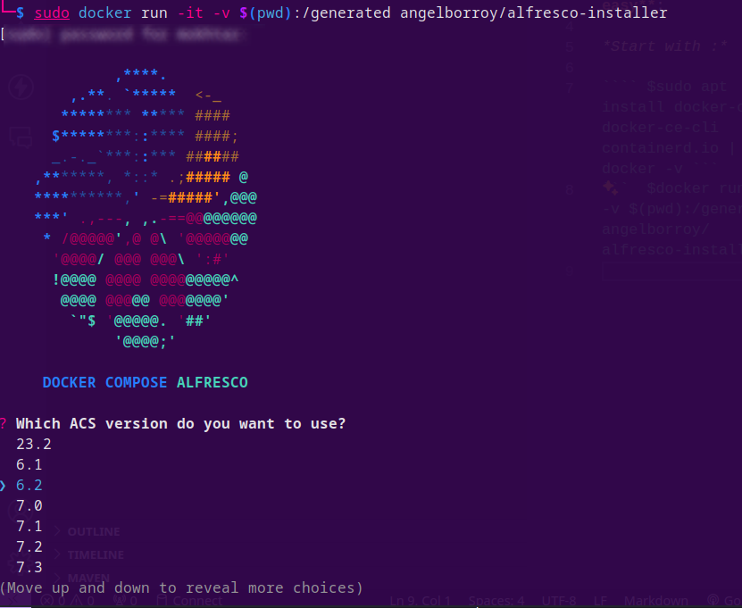
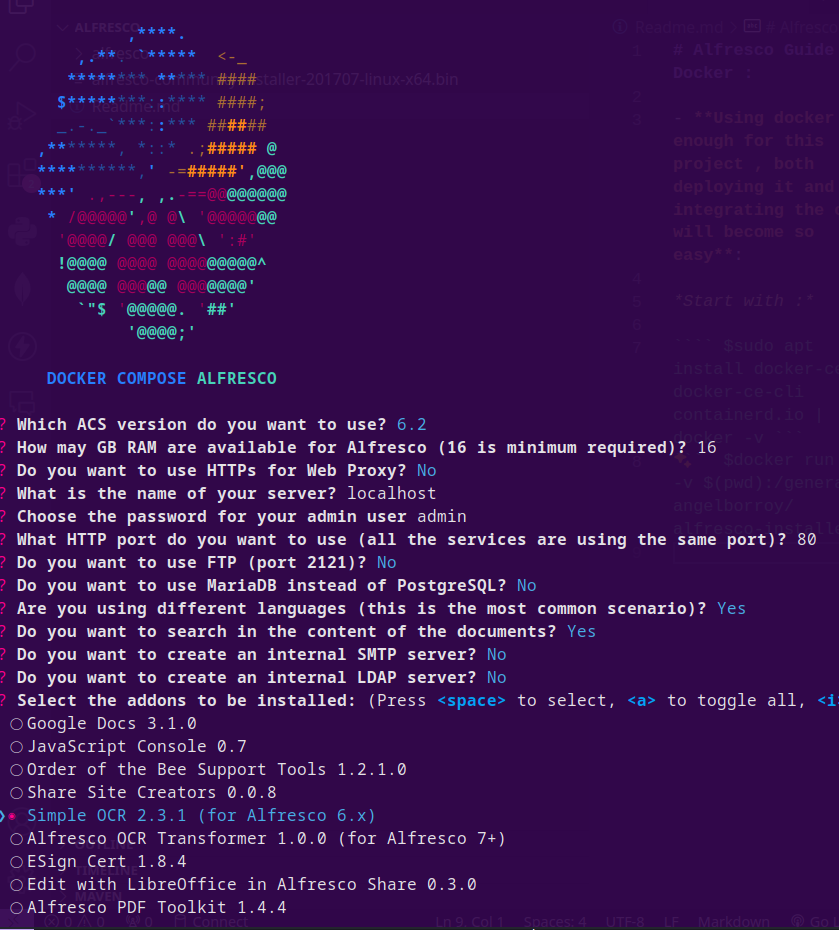

# Alfresco Small Guide For SI Project : 

# Docker : 

- **Using docker is enough for this project , both deploying it and integrating the ocr will become so easy**: 

| *Start with :*
```$sudo apt update && upgrade 1``` <br><br>
``` $sudo apt install docker-ce docker-ce-cli containerd.io | docker -v```<br></br>
```  $docker run -it -v $(pwd):/generated angelborroy/alfresco-installer```

<div align="center" style="margin-top: 30px;margin-bottom: 30px;">
    
    
</div>


| *Then just use :* : ```$sudo docker-compose up``` check your localhost:port And you are ready to go !


- <b>in case of permission issues use the scripts bellow , and check your memory capcity ! </b>


# Linux / Windows  : 

- **For Windows get the installer from the offical site and use it directly**<br>
- **for Linux you can use :** <br> 
```$wget https://download.alfresco.com/release/community/201707-build-00028/alfresco-community-installer-201707-linux-x64.bin ``` <br>
```$sudo chmod 755 alfresco-community-installer-201707-linux-x64.bin```<br>
```$sudo ./alfresco-community-installer-201707-linux-x64.bin ```<br><br>

# Integrating THE OCR  : 

- Download Tesseract or Pdfsandwich form their offical repos 

- add transformation xml file  in "C:\alfresco-community\tomcat\shared\classes\alfresco\extension" (winodws) | /opt/alfresco/tomacat/shared/classes/extension (linux)

- Specify the Paths to tesseract and add ocr.sh | ocr.bat in your Alfresco root Folder (/opt/alfresco) || (C:\alfresco-community)

- Add this 2 lines in your ```alfresco-global.properties``` in classes folder of alfresco : 
##OCR##
ocr.script=/opt/alfresco/ocr.sh
ghostscript.exe=gs
    
- Restart both postgress and tomacat Servers and you are ready to go ! 